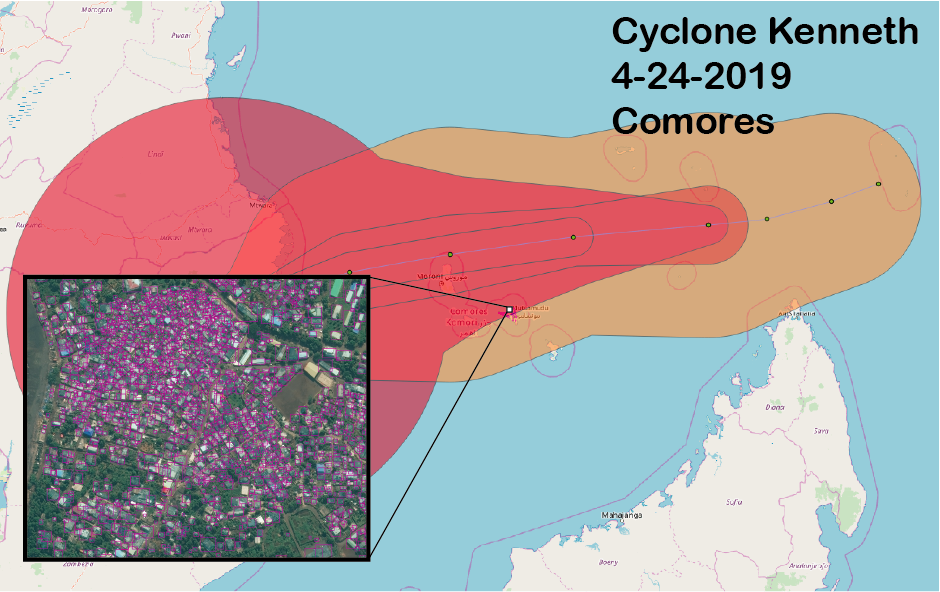

# Sagely

_Purpose_: Use OSM vector data to train a convolutional neural network (CNN) in AWS Sagemaker for building, road, (etc) object detection.

_Inputs_: Location of HOT-OSM task OR city/state/country of interest & a web-url to DG Cloud Optimized Geotif (COG).

_Outputs_: TMS (slippy map) training data using the OSM vectors + AWS Sagemaker model endpoint.



## This repo is still a work in progress! 

There are TWO parts to this workflow. The first is best illustrated by checking out the ipynb tutorial that will walk you through the OSM vector data to ML training data. Once the traing data is generated, you can use the following scripts to create a virtual environment for AWS Sagemaker training.

To use this tutorial, a good starting point will be the two ipynb (part I and part II).

[OSM ML, Part I](https://github.com/shaystrong/sagely/blob/master/osm_ml_training_pt1.ipynb)

[OSM ML, Part II](https://github.com/shaystrong/sagely/blob/master/osm_ml_training_pt2.ipynb)


### _Setup Your Machine_

1) setup a virtual environnment: 

```console
ubuntu$ virtualenv -p python3 sagemaker_trans
ubuntu$ source sagemaker_trans/bin/activate
ubuntu$ cd sagemaker_trans/
```

2) Clone this repo onto your local machine.

```console
ubuntu$ git clone https://github.com/shaystrong/sagely.git
ubuntu$ cd sagely/
```

3) Run the setup. It will install necessary libraries

```console
ubuntu$ sh setup.sh
```

### _Download Script_
```console
ubuntu$ sh get_data.sh
```

This will download the mxnet .rec files generated at the end of the part I ipynb. This will also download the full set of DG tiles that we will infer against later. 

You can start from here to run sagemaker (part II), or you can follow the label generation process from the start in part I. The part II notebook is strictly running a Sagemaker training event and creating an endpoint. 

### _Test_
 
Assuming you either have created an endpoint, you can predict labels using the endpoint. Edit the `test.sh` script to include your endpoint and data location.

### _Clean Up_

```console
deactivate
rm -rf /path/to/venv/sagemaker_trans/
```


## Train

## Watch!

Watch you model training on Sagemaker! You can login to the AWS console and see the progression of the learning as well as all your parameters. 

## Metrics

None Yet!

## Notes

Your OSM vector data may be messy, and or may not align with the imagery. It is up to you to manually inspect, modify, cull the training data generated for optimal model performance. There is no step presented here to do this for you. In fact, it is a critical step as a Data Scientist that you own that element.
